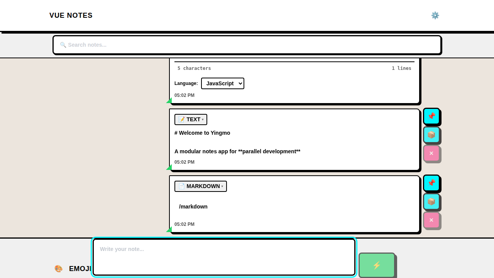

# Yingmo

A pluggable, modular notes application designed for **parallel development by multiple contributors**. The architecture emphasizes extensibility, separation of concerns, and minimal code changes to enable simultaneous work across the codebase.


_Auto-generated screenshot from CI showing the current state of the application_

## Core Philosophy

**Modularity First**: Every feature is a self-contained module that registers itself with the central registry. This allows multiple contributors to work on different modules simultaneously without conflicts.

**Dependency Injection**: Services, stores, and handlers are injected rather than imported directly, enabling isolated development and testing.

**Convention over Configuration**: Follow established patterns (see CONTRIBUTING.md) to ensure consistent code style across all contributions.

**Library Agnostic**: Current UI/state libraries are implementation details that may evolve. Focus on architectural patterns, not specific frameworks.

For detailed store architecture patterns, see:

- [src/stores/notes/README.md](src/stores/notes/README.md)

## Repository Structure

```
.
├── src/
│   ├── modules/              # 🔌 Pluggable note type modules (text, markdown, code, etc.)
│   ├── stores/
│   │   └── notes/           # 📦 Modular store (utils, tags, sync, categories, storage)
│   ├── core/                # 🏗️  Module registry and initialization
│   ├── types/               # 📝 Shared type definitions (module.ts, note.ts)
│   ├── services/            # 🔧 Injectable services (NoteService, apiClient)
│   └── components/          # 🎨 UI components
├── sync-server/             # 🔄 Optional sync server with module system
├── docs/                    # 📚 Architecture and development guides
└── CONTRIBUTING.md          # 🤝 Collaboration guide
```

**Key Directories for Parallel Development:**

- `src/modules/*` - Add new note types independently
- `src/stores/notes/*` - Extend store capabilities in isolation
- `src/services/*` - Add new services without touching existing code
- `sync-server/modules/*` - Mirror frontend modules on server

## Quickstart

Requirements:

- Node.js >= 18

Install dependencies:

```
npm install
```

Run the frontend dev server:

```
npm run dev
```

Build for production:

```
npm run build
```

Preview the production build:

```
npm run preview
```

Run unit tests:

```
npm test
```

Run e2e tests (CI mode):

```
npm run test:e2e
```

Optional: start the sync server (in a separate terminal):

```
cd sync-server
npm install
npm run dev
```

By default, the server maps to port 4444 (see Docker script mapping).

## Scripts

From package.json:

- Dev: `npm run dev` or `npm run dev-host`
- Build: `npm run build`
- Preview: `npm run preview`
- Unit tests:
  - `npm test`
  - `npm run test:ui`
  - `npm run test:coverage`
- E2E tests:
  - `npm run test:e2e`
  - `npm run test:e2e:ui`
  - `npm run test:e2e:headed`
  - `npm run test:e2e:debug`
- Linting & Formatting:
  - `npm run lint` - Check code style
  - `npm run lint:fix` - Auto-fix linting issues
  - `npm run format` - Format code with Prettier
  - `npm run format:check` - Check formatting without changes

Sync server scripts (see [docs/sync-server.md](docs/sync-server.md)):

- Dev: `npm run dev`
- Build: `npm run build`
- Start: `npm start`
- Lint: `npm run lint` / `npm run lint:fix`
- Type check: `npm run type-check`
- Drizzle:
  - `npm run db:generate`
  - `npm run db:migrate`
  - `npm run db:studio`
- Docker:
  - `npm run docker:build`
  - `npm run docker:run` (exposes :4444)

## Architecture

**Plugin System**: Central `ModuleRegistry` manages all note type modules

- Each module: self-contained with types, handlers, components
- Registration: `await moduleRegistry.register(yourModule)`
- Zero coupling between modules

**Modular Store**: Pinia store split into focused modules

- `utils.ts` - Pure functions (ID generation, cloning, timestamps)
- `tags.ts` - Tag extraction with Unicode support
- `sync.ts` - Offline queue and server sync with dependency injection
- `categories.ts` - Reference-counted category indexing
- `storage.ts` - Persistence abstraction (in-memory for tests)

**Service Layer**: Injectable services via registry

- `NoteService` - CRUD operations abstracted from store
- `apiClient` - HTTP client for sync server
- Custom services registered in `ModuleRegistry`

**Type Safety**: Strict TypeScript with shared types

- `src/types/module.ts` - Module system contracts
- `src/types/note.ts` - Note type definitions
- All modules implement standard interfaces

See detailed patterns in:

- [docs/architecture.md](docs/architecture.md) - System design and data flow
- [docs/development.md](docs/development.md) - Code conventions and patterns
- [docs/linting-formatting.md](docs/linting-formatting.md) - Linting & formatting setup
- [src/stores/notes/README.md](src/stores/notes/README.md) - Store architecture patterns

## Development & Contributing

**Read [CONTRIBUTING.md](CONTRIBUTING.md) first** - Essential guide for parallel development

Key principles:

1. **One module per PR** - Minimize merge conflicts
2. **Follow existing patterns** - Check similar modules for conventions
3. **Use dependency injection** - Never hardcode service references
4. **Write isolated tests** - Each module must be independently testable
5. **Register, don't import** - Use `ModuleRegistry` for cross-module access
6. **Lint and format** - Run `npm run lint:fix` and `npm run format` before committing

CONTRIBUTING.md contains:

- Module development workflow
- Code patterns and conventions
- Testing requirements
- Lint and format guidelines
- How to avoid conflicts with others
